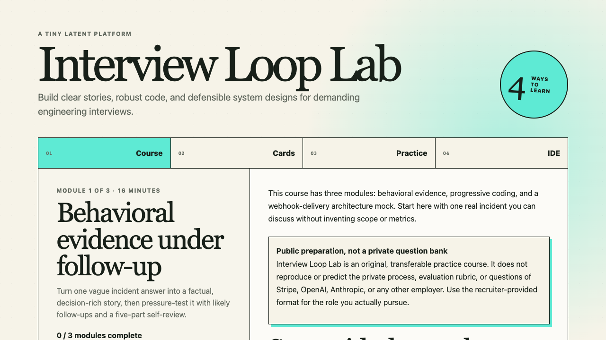

# Latent

**Turn the sources you care about into something you can actually learn.**

Latent is an open-source framework for turning source collections—codebases,
research papers, technical documentation, or your own notes—into interactive
courses with coding agents. Give the agent the material, what you want to be
able to do, and what you already know. It builds a source-grounded path through
explanations, retrieval, and practice so the context becomes yours.

The finished course is a static site you own. It does not require a Latent
account, hosted model, or execution server.

[](https://github.com/model-systems-labs/latent/actions/workflows/ci.yml)
[](./LICENSE)
[](./CONTENT_LICENSE.md)

[](./docs/readme/agent-course-demo.webm)

**Live examples:** [Learning Studio](https://model-systems-labs.github.io/latent/)
— choose a complete course or focused practice ·
[Build an LLM System](https://model-systems-labs.github.io/latent/llm-systems/)
— 14 browser labs that become a working chat capstone ·
[Interview Loop Lab](https://model-systems-labs.github.io/latent/interview-loop/)
— behavioral, coding, and architecture preparation ·
[Ten Problems](https://model-systems-labs.github.io/latent/practice/)
— focused Python practice with saved drafts and review.

[Watch the Interview Loop demo](./docs/readme/agent-course-demo.webm) ·
[Source](./examples/learning-platform/interview-loop) ·
[Authoring record](./examples/learning-platform/interview-loop/AUTHORING.md)

## Learn from a source collection

```bash
git clone https://github.com/model-systems-labs/latent.git
cd latent
npm ci
```

Open the folder in your coding agent. To learn a codebase, ask:

```text
Read skills/learn-from-sources/SKILL.md and use that workflow. Treat this
repository at its current commit as the source collection. Build a course that
teaches me enough to trace a Learning Pack from JSON validation through the
static-site build. Assume I know TypeScript but not this architecture. Cite
exact repository permalinks, validate the pack strictly, and start a preview.
```

For a collection of papers, point the agent at the files and their canonical
URLs:

```text
Read skills/learn-from-sources/SKILL.md and use that workflow. The source
collection is papers/ plus the canonical URLs in SOURCES.md. Build a two-hour
course that prepares me to compare the papers' assumptions, explain where
their results conflict, and design a small reproduction. Preserve uncertainty
and cite every central claim. Validate it strictly and start a preview.
```

The workflow freezes the source set, maps evidence to observable objectives,
and leaves behind a course you can inspect, revise, version, and deploy. Any
capable file-editing agent can follow
[`skills/learn-from-sources/SKILL.md`](./skills/learn-from-sources/SKILL.md);
Latent itself does not require a particular model provider.

## Build a complete learning platform

Use
[`skills/author-learning-platform/SKILL.md`](./skills/author-learning-platform/SKILL.md)
when the result needs coding practice, a browser IDE, or trusted executable
checks in addition to portable lessons and flash cards.

```text
Read skills/author-learning-platform/SKILL.md and use that workflow to create
an interview course for experienced engineers preparing for high-bar product
and AI infrastructure companies. Include behavioral drills, progressive
coding practice, and a worked system-design framework. Build it, validate it,
and start a preview.
```

For a purpose-made simulator, worked trace, or explorable diagram inside a
reviewed Latent application, use
[`skills/author-interactive/SKILL.md`](./skills/author-interactive/SKILL.md).
That workflow lets an agent author ordinary HTML, CSS, and JavaScript, while
the platform supplies the visual contract, opaque sandbox, exact-version
state, and host-validated progress. It is a trusted source extension, not an
executable field in a portable course pack.

## What you get

- **Composition primitives:** Course and Module.
- **Learning primitives:** Lesson, Flash cards, Question Group, and IDE
  exercise.
- **Trusted extensions:** Stateful HTML/CSS/JavaScript lesson interactives
  with bounded host capabilities.
- **Embedded blocks:** Knowledge check, code block, callout, headings, and
  lists.
- **Framework services:** Progress, resume, review, persistence, navigation,
  and themes.

- Lessons, knowledge checks, flash cards, coding practice, and browser IDEs.
- Browser-local workers and reviewed WebAssembly runtime adapters, so coding
  practice can run without a hosted execution service.
- Device-local learner progress and a deterministic static build deployable to
  GitHub Pages, S3, Cloudflare Pages, Netlify, or any static host.

Agents act during authoring and build, not inside the learner runtime. Portable
course packs stay declarative; executable checks, runtimes, UI, and persistence
remain reviewed repository source.

Start with the [source-learning workflow](./skills/learn-from-sources/SKILL.md),
use the [five-minute platform guide](./docs/getting-started.md), read the
[architecture](./docs/architecture.md), or [contribute](./CONTRIBUTING.md). Run
`npm run validate` before opening a pull request.

Course Kit v0.2.0 is available as a
[pinned release artifact](https://github.com/model-systems-labs/latent/releases/download/course-kit-v0.2.0/latent-course-kit-0.2.0.tgz).
Code is [Apache-2.0](./LICENSE). Identified educational content is
[CC BY 4.0](./CONTENT_LICENSE.md).
